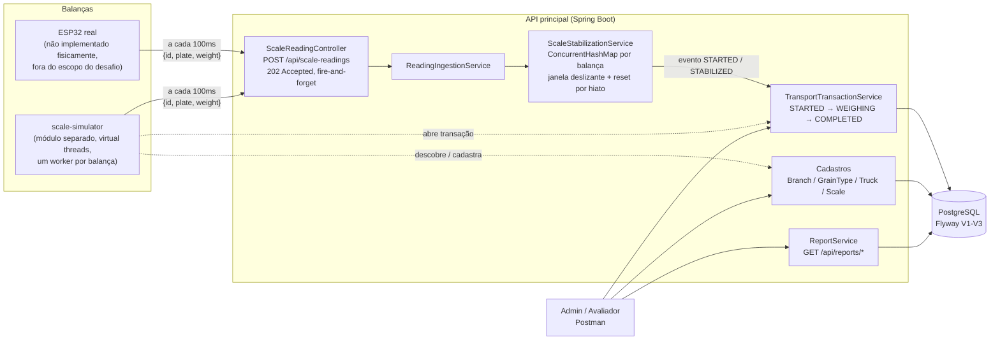

# Decisões de Arquitetura e Melhorias Futuras

Este documento registra as decisões de design tomadas durante o desenvolvimento do desafio técnico, o raciocínio por trás delas, e o que ficou deliberadamente fora do escopo do "básico" para ser tratado como diferencial ou melhoria futura. O histórico de prompts usados com IA está em `PROMPTS.md`.

## Arquitetura

- **Ingestão desacoplada da persistência**: o controller aceita a leitura e devolve `202` imediatamente; a estabilização acontece em memória (`ScaleStabilizationService`) e só toca o banco quando um evento relevante ocorre (início ou fim de pesagem) — não a cada leitura de 100ms.
- **`scale-simulator` fala com a API como um cliente externo**: mesma porta de entrada que o ESP32 usaria (`/api/scale-readings`), mais os endpoints normais de cadastro/transação para se auto-provisionar — não há acoplamento de código entre os dois módulos.
- Ver a seção "Ingestão via fila (Kafka/RabbitMQ)" mais abaixo para a alternativa considerada e descartada para este escopo.

## Stack

- **Spring Boot 4.1.0 / Java 25 / PostgreSQL 16 + Flyway**: schema versionado via migration (`src/main/resources/db/migration`), `spring.jpa.hibernate.ddl-auto: validate` — o Hibernate nunca gera schema, só valida contra o que o Flyway aplicou.
- **Docker Compose** sobe Postgres, a API principal e (opcionalmente, via profile) o `scale-simulator` — ver `docker-compose.yml` e `INSTRUCTIONS.md`.

## Modelagem de domínio

- **`TransportTransaction` embute a pesagem** (não existe uma entidade `Pesagem` separada). O próprio enunciado define a transação de transporte como "a transação de compra e pesagem de grãos de um tipo para um caminhão, início e fim" — criar uma entidade 1:1 adicional seria uma junção desnecessária.
- **`Scale.code` é uma chave natural (String)**, não um ID substituto. É exatamente o `id` que o ESP32 manda no payload — usar um Long artificial exigiria um índice único redundante sem ganho real.
- **Preço de compra e tara são "congelados" (snapshot) na transação** no momento da pesagem (`purchasePriceSnapshot`, `tareWeightKg`). Se o preço do grão ou a tara cadastrada do caminhão mudarem depois, o histórico não é reescrito.
- **Leituras brutas (a cada 100ms) não são persistidas** — só o resultado final estabilizado. Guardar cada leitura individual seria volume desnecessário para o que o desafio pede. Ver "Melhorias futuras" para uma opção de auditoria.

## Estratégia de estabilização

Estado por balança (`ScaleSession`, em memória, chave = código da balança): `IDLE → ACCUMULATING → STABILIZED → IDLE`.

- **Critério de estabilização**: janela deslizante de leituras (`window-duration`, default 1000ms); estabiliza quando há pelo menos `min-samples` (default 10) amostras na janela e `max - min <= tolerance-kg` (default 20kg). O valor persistido é a média da janela, não a última leitura isolada.
- **Detecção de "caminhão saiu" via hiato de leituras, não queda de peso**: o enunciado diz que o ESP32 manda leitura a cada 100ms *enquanto houver caminhão presente* — não "até estabilizar". Ou seja, mesmo depois de estabilizado, se o caminhão continuar fisicamente na balança (fila, papelada), as leituras continuam chegando. Por isso, o reset de sessão não depende do peso cair a zero: se uma leitura nova chega depois de um hiato maior que `stale-after` (default 3s, bem acima do 100ms esperado), a sessão anterior é considerada obsoleta e resetada antes de processar essa leitura como uma nova sessão. Isso evita um timeout arbitrário baseado em "quanto tempo ficou estabilizado" (que não tem limite previsível — o caminhão pode demorar pra sair).
- **Correlação com `TransportTransaction`**: a 1ª leitura válida de uma balança busca a transação `STARTED` daquela placa e marca `WEIGHING`; a estabilização busca a transação `WEIGHING` daquela placa e marca `COMPLETED`. Não há necessidade de idempotência adicional aqui porque a máquina de estados da própria `ScaleSession` já garante que cada evento (`STARTED`/`STABILIZED`) só dispara uma vez por sessão.

## Cálculo de custo e margem

- **Custo da carga** = peso líquido (toneladas) × preço de compra do grão no momento da pesagem.
- **Margem de venda (5%–20%) inversamente proporcional ao estoque**: em vez de um campo de referência por tipo de grão, optamos por um **valor de referência global** (`pricing.margin.reference-quantity-tons`, default 500t) — simplificação consciente. Fórmula: `margem(q) = max - (max - min) * min(q / referenceQty, 1)`. Quando o estoque atinge a referência, margem = mínima (5%); estoque zero, margem = máxima (20%).
- **Estoque (`GrainType.availableQuantityTons`) é incrementado quando uma pesagem completa** — o caminhão está *chegando* com grão (busca na fazenda, retorno pra doca), não saindo. O desafio não pede um fluxo de venda/saída de estoque.

## Concorrência e consistência

- **`@Version` (optimistic locking)** em `Branch`, `GrainType`, `Truck`, `Scale` — protege edições concorrentes via `PUT` (dois admins editando o mesmo cadastro). Conflito vira `409` (`ApiExceptionHandler`).
- **Incremento de estoque via `UPDATE` atômico**, não via entidade + `@Version`: duas balanças completando pesagens do mesmo tipo de grão quase simultaneamente não podem usar o padrão "ler → somar em memória → salvar" (perde update). Em vez de depender de `@Version` + retry, o incremento é feito direto no banco (`GrainTypeRepository.incrementAvailableQuantity`), e o lock de linha do Postgres serializa a operação sem precisar de lógica de nova tentativa.
- **Regra "1 transação aberta por caminhão"** garantida em dois níveis: índice único parcial no Postgres (`uq_truck_active_transaction`) + checagem na aplicação antes de criar.

## Segurança

Nenhuma autenticação/autorização implementada ainda — nem nos cadastros, nem no endpoint de leitura das balanças. É o item 5 (diferencial) do desafio, tratado depois do básico.

## Simulador autônomo de balanças

Módulo Maven separado (`scale-simulator/`), no mesmo repositório mas com build e deploy independentes (`pom.xml`, `mvnw` e `Dockerfile` próprios) — simula múltiplos ESP32 mandando leituras concorrentes contra a API principal.

- **Spring Boot sem servidor web** (`spring.main.web-application-type: none`): reaproveita o mesmo padrão de `@ConfigurationProperties` já usado no resto do projeto (`simulator.*` no `application.yaml`, com `Duration` parseado de `"100ms"` do mesmo jeito que `scale.stabilization.window-duration`), em vez de inventar um parser de configuração próprio. Sem JPA/Tomcat — só `spring-web` (para `RestClient`) e Jackson.
- **Descoberta contínua, não só no startup**: a cada `simulator.discovery-interval` (default 30s), o simulador relista as balanças ativas (`GET /api/scales`) e reconcilia com os workers que já estão rodando — inicia um worker novo pra cada balança cadastrada depois que o simulador já estava de pé (sem precisar reiniciar) e **interrompe** o worker de qualquer balança que foi deletada ou desativada (`active=false`), em vez de deixá-lo martelando leituras contra uma balança que não existe mais. Isso só foi simples porque o `ScaleWorker` já checava `Thread.interrupted()` no laço principal desde o início (pensado para permitir parada limpa) — bastou cancelar o `Future` correspondente (`future.cancel(true)`) na reconciliação.
- **Pool de caminhões por balança, não 1:1**: cada `ScaleWorker` recebe uma lista de caminhões (não um só) e sorteia um novo a cada ciclo — simula uma fila de caminhões diferentes passando pela mesma balança, como no mundo real, em vez de um caminhão fixo pra sempre. A distribuição de caminhões livres entre balanças novas continua **disjunta** (round-robin na reconciliação): dois pools nunca compartilham um caminhão, porque foi exatamente essa colisão — duas balanças sorteando o mesmo caminhão independentemente — que causava `409 Conflict` e travava a transação em `STARTED` no design anterior (1 caminhão por balança, sorteado sem coordenação entre workers).
- **Bootstrap de dados de demonstração só quando o banco está vazio**: no startup, se `GET /api/scales` não retornar nenhuma balança ativa, ele cria filial/tipo de grão/caminhão/balança de demonstração a partir da lista fixa `simulator.scales` do seu `application.yaml` (via `POST` nos endpoints reais, nunca direto no banco). Se já existir ao menos uma balança, não cria nada — o laço de reconciliação acima é quem descobre e pareia com caminhão/tipo de grão reais (aleatório se houver menos caminhões ou grãos do que balanças, criando só o mínimo necessário se algum desses estiver zerado).
- **Seed de cadastros via migration** (`V3__seed_demo_data.sql`): a app principal já sobe com 1 filial, 2 tipos de grão, 2 caminhões e 2 balanças cadastrados (mesmos valores do `application.yaml` do simulador, de propósito). Assim, o teste do que realmente importa — o pipeline de leitura/estabilização — começa a valer já no primeiro `docker compose up`, sem depender do caminho de auto-bootstrap do simulador.
- **Abre a transação de transporte como um despachante faria**: antes de cada ciclo de pesagem, chama `POST /api/transport-transactions`. Um `409` (caminhão já com transação aberta — ex.: simulador reiniciado no meio de um ciclo) é tratado como sinal de "pode seguir pesando", já que a correlação das leituras com a transação é feita por placa no servidor, não por id de transação.
- **Curva de peso realista por ciclo**, uma balança por virtual thread, todas concorrentes: rampa de subida com ruído decrescente (caminhão entrando/balançando na balança) → acomodação até ficar dentro da tolerância de estabilização → platô (caminhão parado, fila/papelada, continua mandando leitura) → rampa de descida a zero (caminhão saindo) → hiato ocioso aleatório (sem leituras) antes do próximo ciclo. Os hiatos variam acima e abaixo do `stale-after` configurado na app principal, para exercitar tanto a continuação quanto o reset de `ScaleSession`.
- **Chamadas HTTP síncronas em cima de virtual threads**, não fire-and-forget assíncrono: como cada worker já é uma virtual thread barata, bloquear numa chamada HTTP de poucos milissegundos não trava nenhum thread de SO — o código fica simples (sequencial, sem callbacks) e ainda assim escala para dezenas de balanças simuladas.
- **Dockerizado junto com a app principal**: a raiz do repositório também ganhou um `Dockerfile` (multi-stage, usa o próprio `mvnw`) e o `docker-compose.yml` agora sobe `postgres` + `app`. O `scale-simulator` fica atrás de um profile (`docker compose --profile simulator up`) para não gerar dados de demonstração toda vez que alguém só quer subir o sistema limpo.

---

## Melhorias futuras / diferenciais pendentes

Itens deliberadamente fora do escopo do "básico", combinados para tratar depois:

- **Autenticação das balanças** — validar que a requisição em `/api/scale-readings` vem de uma balança autorizada (token por balança, por exemplo).
- **Retentativa e idempotência nas requisições da balança** — o ESP32 é fire-and-forget; não há hoje proteção contra reenvio duplicado de uma mesma leitura.
- **Estado do `ScaleSession` é local à instância da aplicação**: hoje vive num `ConcurrentHashMap` em memória. Se a aplicação rodar com mais de uma réplica atrás de um load balancer sem *sticky routing* por código de balança, leituras da mesma balança podem cair em instâncias diferentes e nunca acumular amostras suficientes pra estabilizar. Correção real exigiria externalizar esse estado (ex.: Redis) ou garantir roteamento fixo por balança no load balancer — não implementado agora porque foge do escopo de uma única instância local, mas é a limitação mais importante para produção multi-réplica. A alternativa de ingestão via fila abaixo resolveria isso de forma mais natural.
- **Sessões de balança órfãs**: deletar uma balança (`DELETE /api/scales/{code}`) não remove a entrada correspondente do mapa em memória do `ScaleStabilizationService`. Impacto é mínimo (poucos bytes por balança), mas seria simples de corrigir escutando o evento de exclusão.
- **Auditoria de leituras brutas**: hoje só o resultado final estabilizado é persistido. Se houver necessidade de rastrear o histórico completo de oscilação (ex.: para debugging de balanças com defeito), seria necessário um log separado (possivelmente numa tabela append-only ou storage de série temporal), fora do escopo atual pelo volume gerado (a cada 100ms por balança).
- **Referência de margem por tipo de grão**: hoje é um valor único global (`500t`) para todos os grãos. Um refinamento seria um campo por `GrainType`, já que grãos diferentes podem ter volumes "normais" de estoque bem diferentes entre si.

### Ingestão via fila (Kafka/RabbitMQ) em vez de HTTP direto

Decisão consciente: manter a ingestão via HTTP síncrono (`POST /api/scale-readings` → `ReadingIngestionService` → `ScaleStabilizationService` em memória) para este teste, mas registrar aqui a alternativa considerada para um cenário de produção com escala maior (centenas de balanças).

**Por que HTTP direto continua sendo a escolha certa para o escopo atual:**
- O ESP32 é quem inicia a comunicação, e ele fala HTTP — não existe client Kafka/AMQP leve o suficiente para rodar nesse tipo de microcontrolador. Trocar para fila não eliminaria o endpoint HTTP; só adicionaria um gateway HTTP → producer na frente dele, aumentando a complexidade sem resolver nada que o escopo deste teste exige.
- A estabilização depende de uma janela deslizante ordenada no tempo por balança. Hoje isso é trivial porque cada requisição cai direto na memória da mesma instância, na ordem em que chega. Uma fila exigiria garantir ordenação por partição (chave = código da balança) para não quebrar essa premissa.
- Menos infraestrutura para operar e explicar num teste técnico time-boxed. Adicionar um broker de mensageria só para "usar Kafka" seria over-engineering sem ganho real neste escopo.

**O que uma fila resolveria, se este fosse um cenário de produção real:**
- **Resolve diretamente a limitação de `ScaleSession` por instância** (item acima): particionando por código da balança (partition key no Kafka, ou consistent-hash exchange no RabbitMQ), cada partição é consumida por exatamente uma instância por vez — um *sticky routing* natural, sem precisar externalizar estado em Redis.
- **Durabilidade**: hoje a ingestão é fire-and-forget — se a aplicação estiver fora do ar no momento da leitura, ela se perde. Uma fila absorve o pico e garante que a leitura não desapareça, endereçando também parte do item de retry/idempotência.
- **Múltiplos consumidores sem duplicar lógica**: o item de auditoria de leituras brutas (acima) viraria um segundo consumer group lendo do mesmo tópico, sem tocar no pipeline de estabilização existente.

Conclusão registrada: HTTP direto é a decisão correta para o volume e o escopo deste desafio; fila é a evolução natural se o número de balanças/réplicas crescer a ponto de o estado em memória por instância deixar de ser viável.